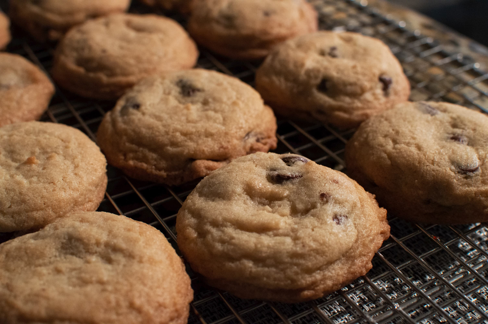

# Chocolate Chip Cookies 
by Jakob Johnson adapted from [Original Toll House Cookies](https://www.allrecipes.com/recipe/174864/original-nestle-toll-house-chocolate-chip-cookies/)

Makes 3 dozen cookies, recipe adjusted for high altitude.

## Ingredients
* 3 cups all purpose flour
* ⅞ tsp baking soda 
* 1 tsp salt
* 1 cup butter, softened
* ¾ cup sugar
* ¾ cup brown sugar
* 2 large eggs
* 1 tsp vanilla
* 1 cup chocolate chips

## Directions
1. Preheat oven to 350° F.

2. In a small bowl, mix the flour, baking soda and salt and set aside.

3. In a large bowl, cream the butter and sugars until light. Beat in eggs and vanilla until smooth. Gradually add flour mixture until combined. Stir into chips.

4. Cover and refrigerate for a few minutes while you clean up. The goal here is just to prevent the dough from getting too soft. Don't leave it too long as you still need to be able to scoop it.

5. Scoop onto a cookie sheet and freeze for >30 min. This will help the cookies get that perfect shape while still being properly done. As a bonus, you can leave half in a bag in the freezer for some other time. 

6. Bake for ~14 min until lightly browned on top. The cookies will collapse slightly when cooling so err on the side of underbaked. 
